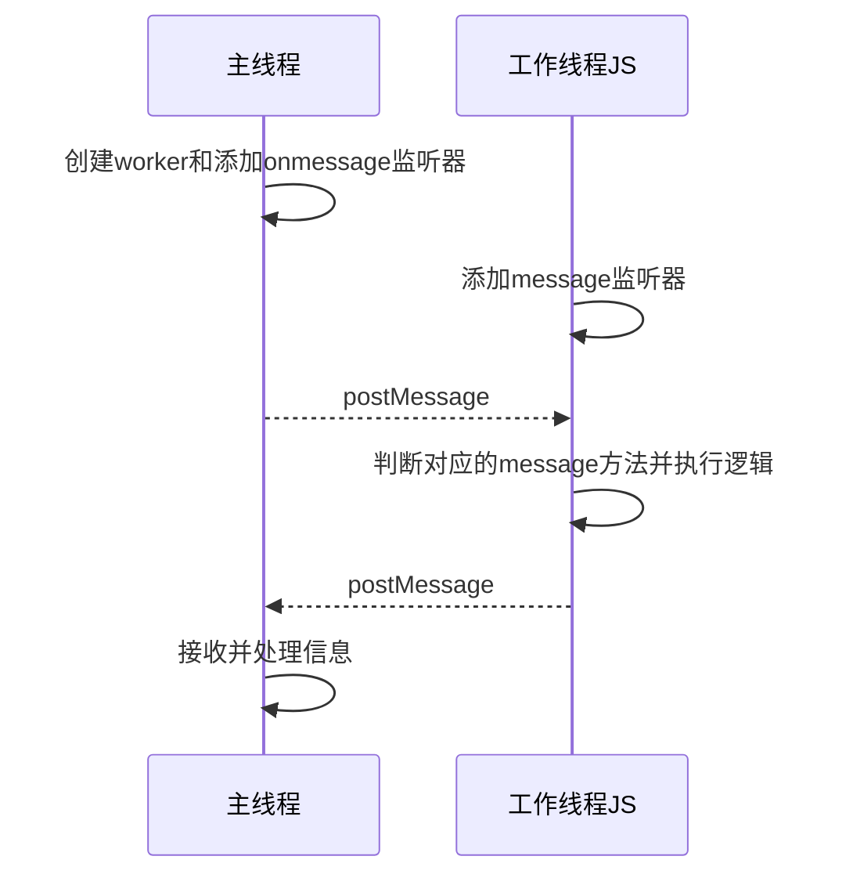

## Web Workers是什么

Web Workers are a simple means for web content to run scripts in background threads. The worker thread can perform tasks without interfering with the user interface.<sup>[\[1\]](https://developer.mozilla.org/zh-CN/docs/Web/API/Web_Workers_API/Using_web_workers)</sup>

简单的翻译就是：`Web Workers`是一个关于在web内容中跑脚本的后台线程的简单方法。工作线程可以在不干扰用户界面的同时执行任务。

看完上面的描述后，可以了解到，他可以在Web页面中创建线程(或进程，不同浏览器中的Worker实现不一样)去执行主程序之外的其他任务。

## 使用WebWorker

要使用webWorker很简单，首先创建一个`worker`实例
```javascript
    new Worker(URL, options);
    /**
     * 它接受两个参数，分别是：
     * URL 表示worker 将执行的脚本的URL。它必须遵守同源策略
     * options {
     *   type: 'classic' | 'module', // 用以指定 worker 类型的  DOMString 值.
     *   credentials: 'omit' | 'same-origin' | 'include', // 用以指定 worker 凭证的 DOMString 值
     *   name: string, // 在 DedicatedWorkerGlobalScope 的情况下，用来表示 worker 的 scope 的一个 DOMString 值，主要用于调试目的
     * }
     */
```
webworker实例提供两个监听器：`onmessage`和`onerror`。同时他还提供`postMessage`方法   
`onmessage`就是监听到数据传入时触发的方法，`onerror`则是用于错误捕捉.   
`postMessage`用于传输数据到工作线程。
通过这些监听器和方法，可以了解到worker的工作流程如下图。



根据时序图可以编写出程序：

```javascript
    // main.js
    const worker = new Worker('worker.js');
    worker.postMessage('hello');
    
    worker.onmessage = function(e) {
      console.log(e.data); // Result: hello
      worker.terminate();
    }
    worker.terminate();
```

```javascript
    // worker.js
    self.onmessage = function(e) {
      console.log(e.data); // hello
      var workerResult = 'Result: ' + e.data;
      postMessage(workerResult);
    }
    
```

上述代码就是一个简单的worker工作流程。    
主线程创建worker后，加载worker.js，**worker.js必须与主页面同源的!!**，之后worker向线程发送消息。   
worker.js收到消息后，执行应的代码，再执行`window.PostMessage`将数据返回到主页面中。   
主页面收到信息后触发onmessage方法，最后调用`terminate`结束工作线程。   
自此，主页面与工作线程通信结束


## Worker的全局作用域

可以注意到，`worker`是一个JS脚本文件那么可以知道，他的作用域与主页面是**独立**的，也就是他们不共享作用与，所以web worker是无法改变DOM的。可以看到，worker线程与主页面相比功能是有限的。      
worker中的全局提供的全局方法有<sup>[2]</sup>:   
1. 最小化的navigator对象，包括onLine，appName，appVersion，userAgent，platform属性
2. 提供只读的location
3. 提供setTimeout，setInterval，clearTimeout，clearInterval方法
4. 提供XMLHttpRequest

除此之外 worker中还能引入其他的脚本文件，我们可以调用`importScript()`的方法接受一个或多个脚本文件。又是需要注意，引入的脚本不能使用**包含页面操作**的代码。

## 共享Worker

上面介绍的worker是只能被生成它的父页面所调用，他是被一个主页面所独占的，这样的worker就叫做`专用worker`   
除了**专用worker**，还有一种工作线程可以被多个主页面所调用，这种worker就叫做**共享Worker**。   
window提供`shareWorker`类来创建共享Worker
```javascript
    // 传入的参数与专用worker一致
    const share = new ShareWorker(URL, options)
    /**
     * share返回一个port属性
     * share.port
     * share.port.start() 开放传输的端口
     * share.port.end() 关闭传输的端口
     * share.port.postMessage() 发送消息，必须先调用share.port.start方法
     */
```
了解了共享Worker后，我们再来写一个例子
```javascript
    // main_1.js 主页面 1
    const share = new ShareWorker('worker.js');
    share.port.start();
    share.port.postMessage('hello');
    // 接收消息出发
    share.port.onmessage = function(e) {
        console.log(e.data); // Result: hello
    }
    
    // worker.js
    onconnect = function(e) {
        const main_1 = e.port[0];
        main_1.onmessage = function(e) {
            main_1.postMessage(`Result: ${ e.data }`);
        }
    }
    
```


## 小结

本文主要介绍了web workers的概念和作用。

## 参考

1. [Web Workers](https://developer.mozilla.org/zh-CN/docs/Web/API/Web_Workers_API/Using_web_workers)
2. JavaScript高级程序设计